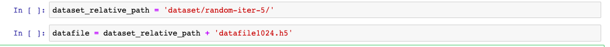
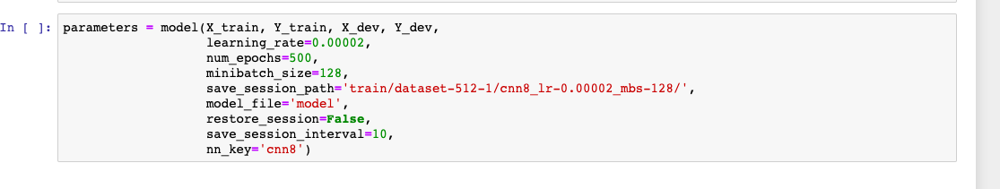
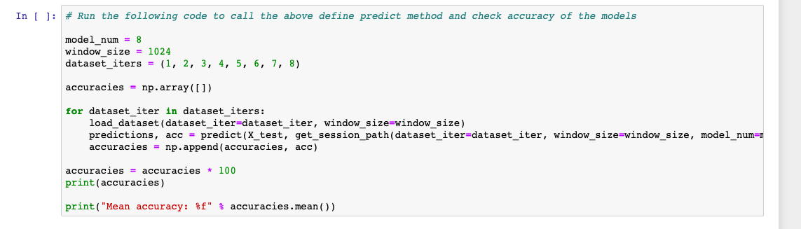

# Description

This project is the code implementation of the neural network models, some of which are supposed to increase efficiency of the detection and three-class classification (ictal, non-ictal, and non-epileptic) of epilepsy problem using 1D EEG brain signals. It is a prototype which can be further standardized and generalized further to other variations of data and then perhaps used in practice.

The publishing of this work is under process and the link will be available on this page as soon as it is ready.

It is clarified that the code is written from scratch by the author in TensorFlow, although the work is derived from Ihsan Ullah, Hussain, Qazi, and Aboalsamh (2018) _An automated system for epilepsy detection using EEG brain signals based on deep learning approach_, but their source code was not used to bootstrap this one.

# Requirements

- Python3
- iPython notebooks (preferably Jupyter installed with Anaconda)
- numpy
- TensorFlow (v 1.10.0 tested. Might face problems on newer versions like 2.0)
- matplotlib
- h5py

# Contents

This project contains these files:

**epilepsy-detection-cnn.ipynb**: iPython notebook used for creating, training, and evaluating models.

**prediction-and-accuracy-measures.ipynb**: iPython notebook aiding the process of evaluating performances of the trained models on test sets.

**read-and-visualize-data.ipynb**: iPython notebook which pre-processes the raw-data given to us.

# Directions of use

### Downloading dataset

Follow the link: [Bonn Dataset](http://epileptologie-bonn.de/cms/upload/workgroup/lehnertz/eegdata.html). The data corresponds to the work published as: Andrzejak RG, et al. (2001) _Indications of nonlinear deterministic and finite dimensional structures in time series of brain electrical activity: Dependence on recording region and brain state_, Phys. Rev. E, 64, 061907

Download the folders, F,N,O,S,Z from the provided link. Copy these folders in the 'dataset' folder of this repository.

Path of a training exapmle should look like: `dataset/F/F001.txt`


### Pre-process the data

After you've finished downloading the data, and made sure you've all the requirements ready, start Jupyter notebook in the repository folder. The command on most systems typically is:

```jupyter notebook```

This should open in a browser. Navigate to the dataset directory, and check that you see folders F,N,O,S,Z. Open, `read-and-visualize-data.ipynb` and go through that notebook. Execute the code segments in sequence by pressing Shift+Enter or using Run cell command.

**read-and-visualize-data.ipynb** augments the data into smaller slices (using silding window), and creates a random permutation of the data. You can create several permutations of the data by running the notebook from the top again and again (we did 8).

To distinguish between each permutation, we declare a variable at the beginning of the notebook, `export_to`, which should be set to `'random-iter-1'`, `'random-iter-2'`, and so on to perhaps `'random-iter-8'`.

Once the dataset is pre-processed, you'll see folders in the dataset folder named, `random-iter-<iteration>`.

### Creating and training models

Start `epilepsy-detection-cnn.ipynb`. Set the variables `dataset_relative_path` and `datafile` as shown in figure to point to the specific permutation of the dataset generated (pre-processed) using aforementioned procedure.

`datafile` can be set to `'datafile512.h5'` or `'datafile1024.h5'` depending on which augmentation scheme (sliding window 512 or 1024) you're working on at the moment.



You do not need to change anything else in the file until you reach the point where you have to train the model. Here you will set the save session path. We've described the format we use in the notebook.



In `save_session_path`, **`'train/dataset-512-1/cnn1_lr-0.0002_mbs-128/'`** means we've trained our model, **cnn1**, on random-iter-1 and 512 sliding window size augmentation scheme. Learning rate was set to 0.0002 and mini-batch size 128. (We used this consistent notation because we trained many models on many permutations of dataset).

Use the same path format if you intend to use the prediction and evaluation functions we defined.

### Prediction and accuracy measures

Start `prediction-and-accuracy-measures.ipynb`. If you've used the save session path notation that we used, the code here should work fine.

To measure accuracy, or accuracy with voting you just need to set these variables:

`model_num`: CNN model you're testing. (For **cnn4** set, this variable to 4.)

`window_size`: 512 or 1024. whether you testing on augmentation scheme 1 or 2 (i.e., sliding window size 512 or 1024).

`dataset_iters`: set of dataset permutations. If you've trained your model on **random-iter-1**, **random-iter-2**, and **random-iter-3** then set this variable to `(1, 2, 3)`. The prediction functions will compute the means of measures on these permutations.



# Authors

This code can be freely downloaded, used, and edited for one's own purpose. Any other works derived from this one must cite the reference to this project.

[Iqaan Ullah Azad](https://www.linkedin.com/in/iqaan) and Aatika Anjum
